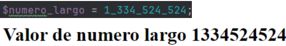
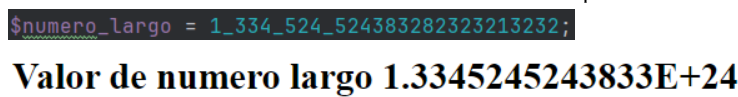
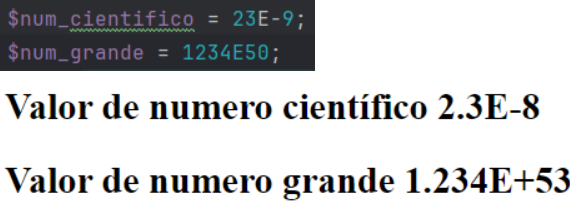

+++
title = 'PHP'
date = 2024-10-04T10:05:33+02:00
draft = false
+++

## Declarar números en PHP

Así se declaran los números binario, octal y hexadecimal en php (0b, 0o, 0x)

Y así podemos transformar un número aleatorio en PHP

Podemos separar un número largo con _ para ayudarnos a leer el número y este se mostrará sin ellas en la página

Si el número es muy largo lo meterá en una fórmula científica donde perderemos algo de precisión, pero nos dirá cómo de largo es

También podemos mostrar números grandes y números científicos