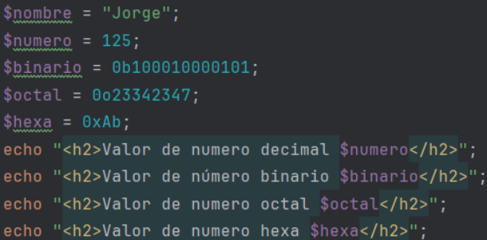
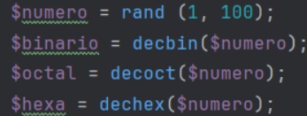

+++
title = 'PHP'
date = 2024-10-04T10:05:33+02:00
draft = false
+++

## Declarar números PHP

Así se declaran los números binario, octal y hexadecimal en php (0b, 0o, 0x)

Y así podemos transformar un número aleatorio en PHP